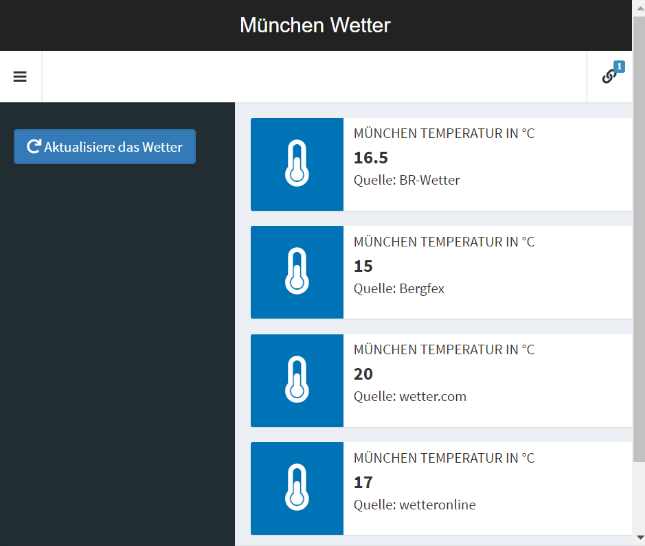

<!-- README.md is generated from README.Rmd. Please edit that file -->

# Munich Weather

A mini project to try out webscraping with the package rvest.

Result: A shiny-web-application that scrapes some live weather data for
my home town Munich from differing sources.

## Teaser

